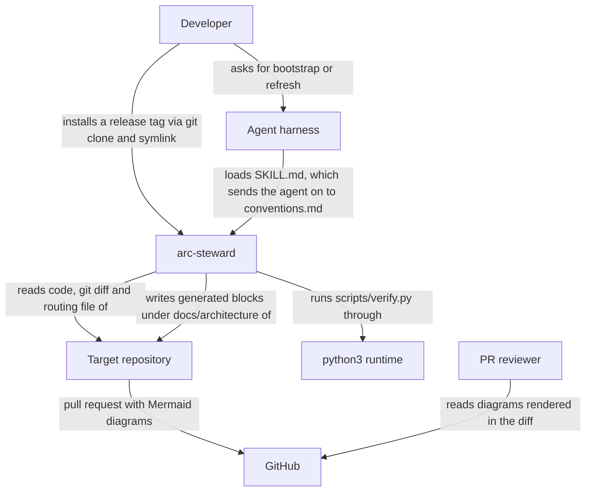

# 01 Context

arc-steward is an [Agent Skill](https://agentskills.io): Markdown instructions a coding agent
follows, plus a small Python harness the agent runs to check its own output. It has no process of
its own. It runs inside whichever agent harness loaded it, against whichever repository that
harness is working in, and it exists to keep that repository's architecture documentation from
drifting away from the code — see [Why avoid architecture drift](../../README.md#why-avoid-architecture-drift).

<!-- arc-steward:generated:context -->

<!-- arc-steward:refs
SKILL.md
conventions.md
README.md
scripts/verify.py
-->

| Element | Role |
|---|---|
| Developer | Installs a tagged release, then asks the agent to bootstrap or refresh the documentation |
| Agent harness | Loads `SKILL.md`, lets the agent execute its procedure, runs the harness through its generic shell tool |
| Target repository | Source of evidence (code, diff, schema sources) and home of the documentation set and its routing file |
| python3 runtime | Runs `scripts/verify.py`; standard library only |
| GitHub | Renders the Mermaid diagrams in the pull request diff, where the review happens |
| PR reviewer | Reviews the documentation change alongside the code change that caused it |
<!-- /arc-steward:generated -->

The harnesses verified so far, and the extra step each needs, are listed under
[Installation](../../README.md#installation).
