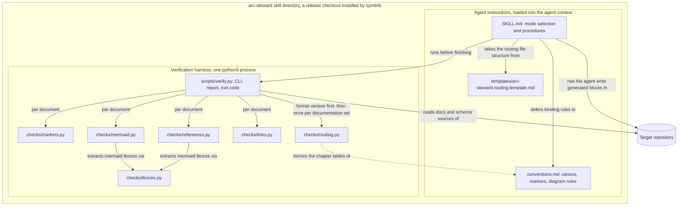
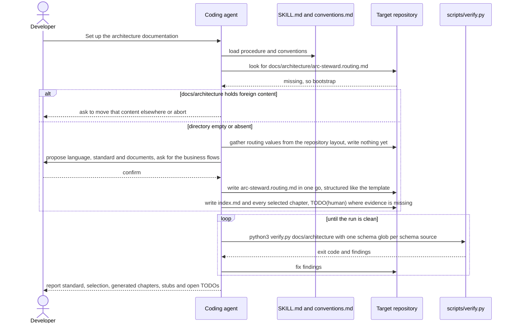
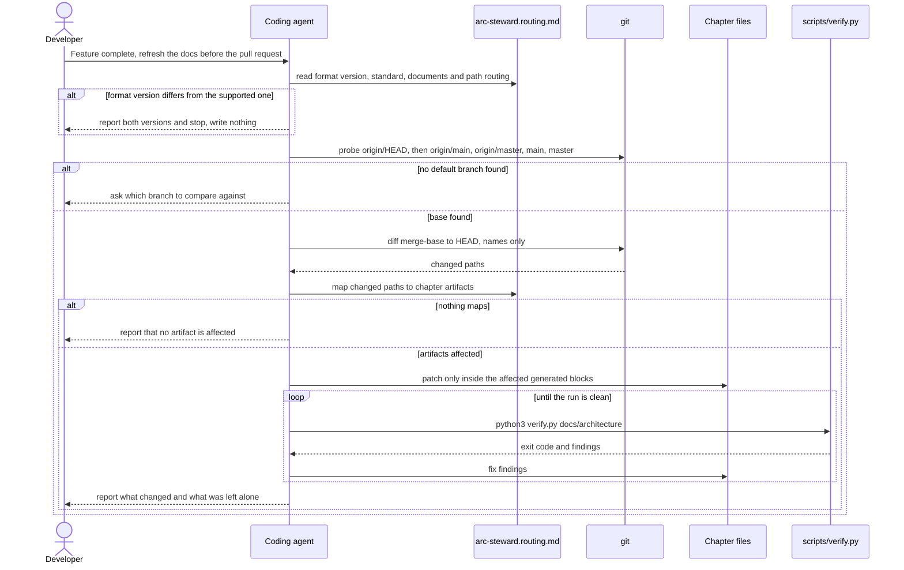

# 06 Software Architecture

arc-steward has two kinds of building blocks. The instruction documents are loaded into the
agent's context and steer its judgement: what to write, where, and when to stop and ask. The
verification harness is ordinary deterministic code the agent runs afterwards, so that every rule
it covers does not rest on the agent having followed an instruction. Both ship together as one
directory — the only deployable unit.

## Components

<!-- arc-steward:generated:components -->

<!-- arc-steward:refs
SKILL.md
conventions.md
templates/arc-steward.routing.template.md
scripts/verify.py
scripts/checks/markers.py
scripts/checks/mermaid.py
scripts/checks/references.py
scripts/checks/links.py
scripts/checks/routing.py
scripts/checks/fences.py
-->
<!-- /arc-steward:generated -->

## Checks

<!-- arc-steward:generated:checks -->
| Check | Scope | Fails the run when |
|---|---|---|
| `markers` | Every document | A provenance marker is unclosed, nested, duplicated within the file, closes without an opening, or its id does not match `[a-z0-9-]+` |
| `mermaid` | Every document | A mermaid fence is unterminated or empty, has an unknown diagram type, unbalanced brackets, or a `subgraph` without `end` |
| `references` | Every document | A path in a reference annotation does not exist, or — when schema globs are given — an `erDiagram` entity is missing from the schema sources |
| `links` | Every document | A relative link target or an anchor does not resolve |
| `routing` | The documentation set | Checked first: the format version is unparseable or differs from the supported one — that finding alone is reported and nothing else runs. Then: the standard or language is unknown or carries more than its value, a section heading appears twice, a selected chapter has no file, the path routing table targets a chapter the set does not contain, or a template placeholder marked `EXAMPLE` is left in the routing file |

`scripts/verify.py` exits 0 when clean, 1 on findings or when it scanned zero documents, and 2 on
a wrong invocation. The exact command is in [Verification](../../SKILL.md#verification).
`routing.py` carries its own copy of the chapter tables from `conventions.md`;
`tests/test_canon_sync.py` fails when the two copies disagree, and
`tests/test_format_version.py` when the supported format version differs between code,
`conventions.md`, the template and this repository's own routing file.

<!-- arc-steward:refs
scripts/verify.py
scripts/checks
tests/test_canon_sync.py
tests/test_format_version.py
-->
<!-- /arc-steward:generated -->

## Runtime flows

### Bootstrap

<!-- arc-steward:generated:flow-bootstrap -->

<!-- arc-steward:refs
SKILL.md
conventions.md
templates/arc-steward.routing.template.md
scripts/verify.py
-->
<!-- /arc-steward:generated -->

### Refresh

<!-- arc-steward:generated:flow-refresh -->

<!-- arc-steward:refs
SKILL.md
scripts/verify.py
-->
<!-- /arc-steward:generated -->
