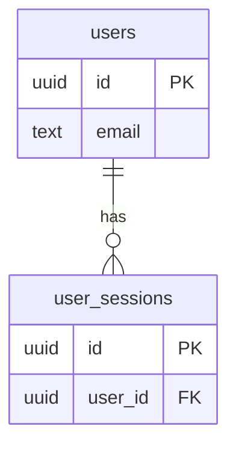

# Users

<!-- arc42:generated:users-erd -->

```mermaid
erDiagram
  users {
    uuid id PK
    text email
  }
  user_sessions {
    uuid id PK
    uuid user_id FK
  }
  users ||--o{ user_sessions : "has"
```
<!-- /arc42:generated -->
