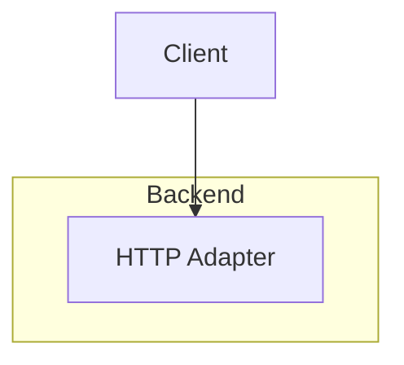

# Building Block View

Hand-written introduction that the refresh must never touch.

<!-- arc-steward:generated:components -->

<!-- arc-steward:refs
backend/src/adapters
-->
<!-- /arc-steward:generated -->

Hand-written outro. The persisted state is described in [the users data model](08-data-model/users.md#users).
